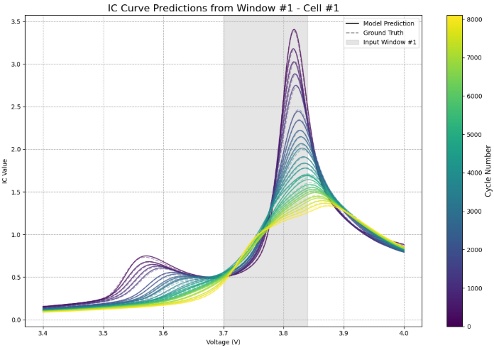
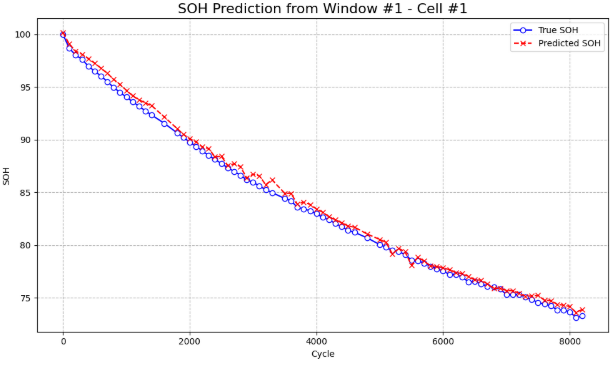

# Oxford Multi-Window IC Reconstruction & SOH Prediction Pipeline
IC (Incremental Capacity) Multi-Window Reconstruction +  SOH Prediction
English Overview

This repository provides a complete 2-stage machine learning pipeline for the Oxford Battery Degradation Dataset:

IC Curve Generation (Gaussian smoothing + Q(V) processing)

Multi-Window IC Reconstruction (Transformer)

Per-Cycle SOH Calculation

SOH Prediction Model (CNN + LSTM hybrid)

Modularized scripts for a fully automated pipeline

It is designed for extended research on lithium-ion battery aging behavior.

📁 Project Structure
.
├── preprocess/
│   ├── oxford_mat_to_csv.py
│   ├── split_by_cell.py
│   ├── ic_interpolation.py
│   ├── sliding_window_builder.py
│   ├── soh_label_builder.py
│
├── reconstruction/
│   ├── ic_transformer_model.py
│   ├── predict_ic_by_window.py
│
├── soh_prediction/
│   ├── soh_dataset_builder.py
│   ├── soh_cnn_lstm_model.py
│   ├── soh_evaluation.py
│
├── predictions_by_window/      # 10 windows × 8 cells reconstruction results
├── oxford_by_cell/             # Raw per-cell data
├── oxford_ic_interpolated/     # IC curves interpolated to 600 points
├── oxford_by_cell_with_SOH/    # Raw cycles with SOH merged
│
├── images/                     # Your saved figures go here
└── README.md

📦 Oxford Battery Dataset (IMPORTANT)

This repository does not include the raw Oxford dataset.
You must download it manually

⚡ IC Pipeline Overview
1) Preprocessing: MAT → CSV

Load .mat file

Extract all cells, cycles, and measurement structures

Convert into Long-format CSV

2) Per-Cell Splitting

Each cell is saved as:

oxford_by_cell/oxford_cell_1.csv
oxford_by_cell/oxford_cell_2.csv
...

3) IC Curve Generation

Using Gaussian smoothing + derivative:

Compute Q(V)

Apply Gaussian derivative

Interpolate into 600 fixed voltage points (3.4V–4.0V)

4) Sliding-Window Dataset Construction

A key design of this project:

The model receives only a partial IC segment (3.7–3.9V)
and must reconstruct the entire 600-point IC curve.

10 windows per cycle

X = partial window segment

Y = full IC curve (600 pts)

5) IC Reconstruction Model (Transformer Only)

CLS token

Positional embedding

Multi-head attention encoder

Dense regression output

Trained to reconstruct full IC curves from windowed inputs

6) Window-wise Predictions (80 files)

Results are saved as:

predictions_by_window/Window_1/Cell_1_pred_from_W1.csv
...

Each row contains:

battery, cycle, voltage, ic_true, ic_pred, SOH

7) SOH Labeling

SOH is computed as:

SOH = capacity / max_capacity * 100

Then merged into all prediction files.

8) SOH Prediction Model (CNN + LSTM)

Input:

Reconstructed 600-point IC curve

Output:

SOH (%)

Model:

Multiple Conv1D layers

Optional MaxPooling

LSTM layer

Dense regression head

Final evaluation on test sets

▶️ How to Run
1. Preprocess Oxford MAT File
python preprocess/oxford_mat_to_csv.py

2. Generate Interpolated IC Curves
python preprocess/ic_interpolation.py

3. Build Sliding-Window Reconstruction Dataset
python preprocess/sliding_window_builder.py

4. Train IC Transformer Reconstruction Model
python reconstruction/ic_transformer_model.py

5. Predict IC Curves for All Windows
python reconstruction/predict_ic_by_window.py

6. Add SOH Labels
python preprocess/soh_label_builder.py

7. Build SOH Dataset & Train CNN-LSTM Model
python soh_prediction/soh_cnn_lstm_model.py

📊 Output Examples
Reconstructed IC vs Ground Truth

  

The figure above shows:
- IC curve prediction

---

📈 Results — Model Prediction Example

  

The figure above shows:
- SOH prediction by reconstructing icc curve from multiwindows

---

# Battery Curve Reconstruction & SOH Prediction Pipeline  
### CC (Constant-Current) + IC (Incremental Capacity) Full Deep Learning Pipeline  

---

# English Overview

This repository provides a complete machine-learning pipeline for:

- **CC Curve Reconstruction** (Residual CNN + Transformer)
- **IC Curve Generation & Reconstruction** (Gaussian smoothing + Transformer)
- **SOH (State of Health) Calculation**
- **SOH Prediction Models** (CNN + LSTM hybrid)
- Modularized scripts for CC and IC workflows

It is designed for research use on NASA battery aging datasets and supports easy extension to other batteries.

---

# 📁 Project Structure
.
├── cc_preprocess.py
├── cc_reconstruct_model.py
├── cc_soh_preprocess.py
├── cc_soh_model.py
├── cc_main.py
│
├── ic_preprocess.py
├── ic_reconstruct_model.py
├── ic_soh_preprocess.py
├── ic_soh_model.py
├── ic_main.py
│
├── data/ # Raw NASA battery data (must download separately)
└── README.md

---

# 📦 NASA Battery Dataset (IMPORTANT)

This repository **does not include** the raw NASA battery dataset.  
You must download it manually:

🔗 NASA Battery Aging Dataset  
[https://data.nasa.gov/dataset/Battery-Aging-Dataset/uj5r-zjdb](https://data.nasa.gov/dataset/li-ion-battery-aging-datasets)

Place the files (e.g., `B0005.csv`, `B0006.csv`, …) into the `data/` directory.

---

# 🚀 CC Pipeline Overview

### **1) Preprocessing**
- Load CC cycle data  
- Extract input portion (e.g., 10%)  
- Normalize & split datasets  

### **2) CC Reconstruction Model**
- Residual CNN blocks + BatchNorm + ReLU  
- Optional Transformer layer  
- Hyperparameter search using KerasTuner  
- Output: Reconstructed full CC voltage curve (300 points)

### **3) SOH Merge**
- Merge CC reconstructed curves with SOH labels  
- Based on capacity retention or provided SOH data

### **4) SOH Prediction**
- CNN + LSTM hybrid model  
- Predicts SOH per cycle  
- Outputs final degradation curves

---

# ⚡ IC Pipeline Overview

### **1) IC Preprocessing**
- Gaussian smoothing on voltage  
- Compute dQ/dV using Gaussian derivative  
- Build long-format dataset (voltage, IC, cycle)

### **2) IC Reconstruction Model**
- Pure Transformer architecture  
- Input section: 3.90–4.00 V  
- Reconstructs the entire IC curve

### **3) IC → SOH Mapping**
- Compute SOH using capacity retention  
- Merge SOH labels per cycle  

### **4) SOH Prediction (IC-based)**
- CNN + LSTM model predicts SOH  
- Produces smooth degradation curves

---

# ▶️ How to Run

### Run the entire CC pipeline:

### Run the entire IC pipeline:

---

# 📊 Output Examples

- Reconstructed CC & IC curves  
- True vs Predicted SOH plots  
- CSV files per battery containing:
  - Full reconstructed curve  
  - Cycle index  
  - SOH  
  - Voltage array / IC curve  

---

---

# 📈 Results — Model Prediction Example

### 🔹 CC Curve Reconstruction + SOH Prediction (Battery #5 Example)

  

The figure above shows:
- SOH prediction by reconstructing cc curve from partial input of cc curve

---

### 🔹 IC Curve Reconstruction + SOH Prediction (Battery #5 Example)

  

The figure above shows:
- - SOH prediction by reconstructing ic curve from partial input of cc curve

---

---

## 📝 Note on NASA.py

The file **NASA.py** included in this repository is **raw experimental code written in Google Colab** during early development.  
It contains exploratory preprocessing, plotting, and experimental model tests used before the final modular pipeline was created.

- It is **not part of the final CC/IC/SOH pipeline**
- It remains in the repository for **reference and reproducibility**
- All finalized code has been refactored into:
  - `cc_preprocess.py`, `cc_reconstruct_model.py`, `cc_soh_preprocess.py`, `cc_soh_model.py`
  - `ic_preprocess.py`, `ic_reconstruct_model.py`, `ic_soh_preprocess.py`, `ic_soh_model.py`

Feel free to ignore *NASA.py* unless you want to check the raw research process.

---

# 🙌 Contributors

- **Jeong-Yong Shin** — Research + Full implementation  
- Assisted by ChatGPT&Gemini (AI pair-programming)

